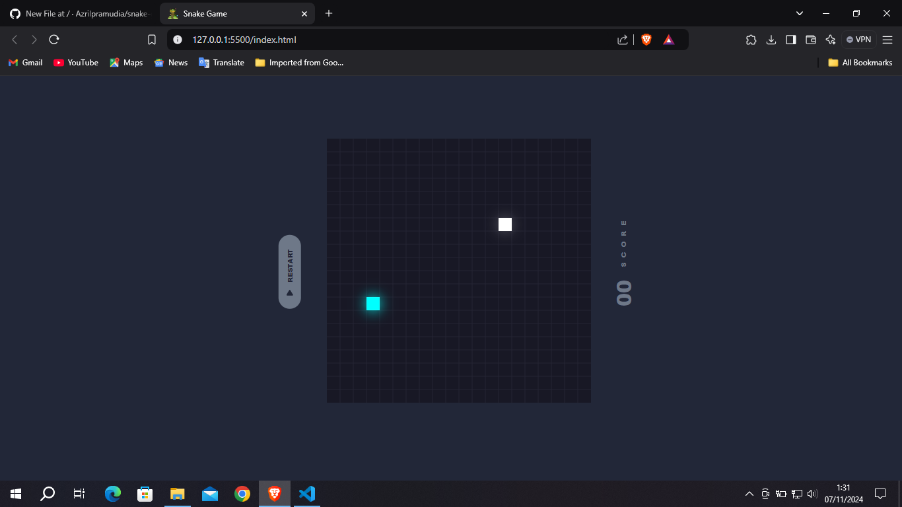
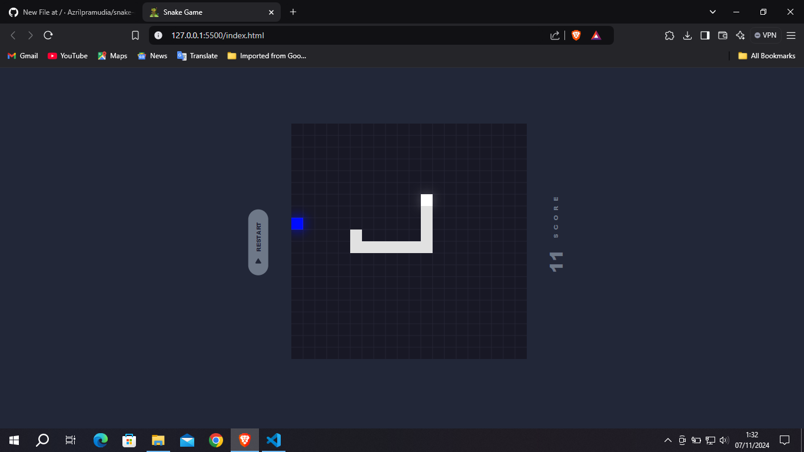
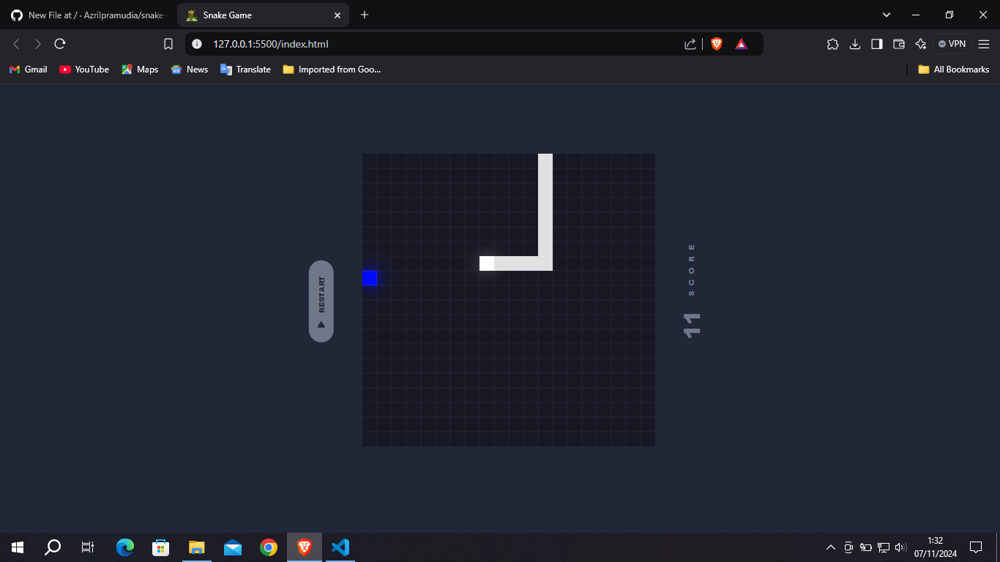
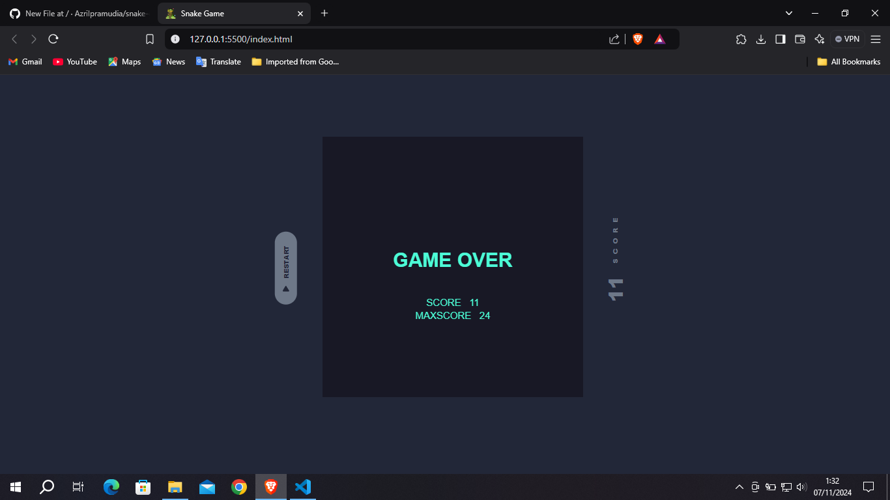

# Snake Games 🐍

<strong>Tech Stack<strong/>
* HTML
* CSS
* JavaScript

## Preview 🎮
1. Start

  
2. Gameplay (screenshoot 1)

  
3. Gameplay (screenshoot 2)

  
4. GameOver

## Reference 👇
<a href = "https://codingstella.com/how-to-make-glowing-snake-game-using-html-css-javascript/" target="_blank">Click ME</a>
